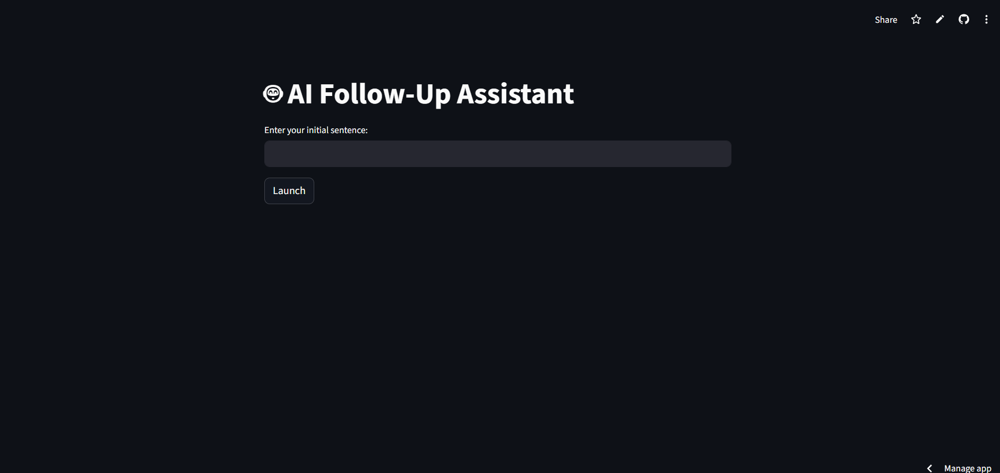
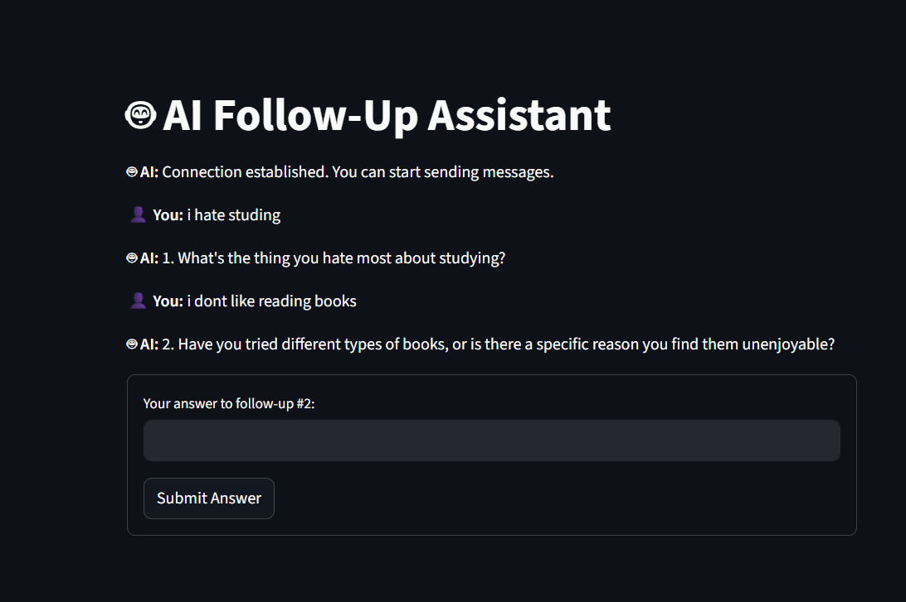
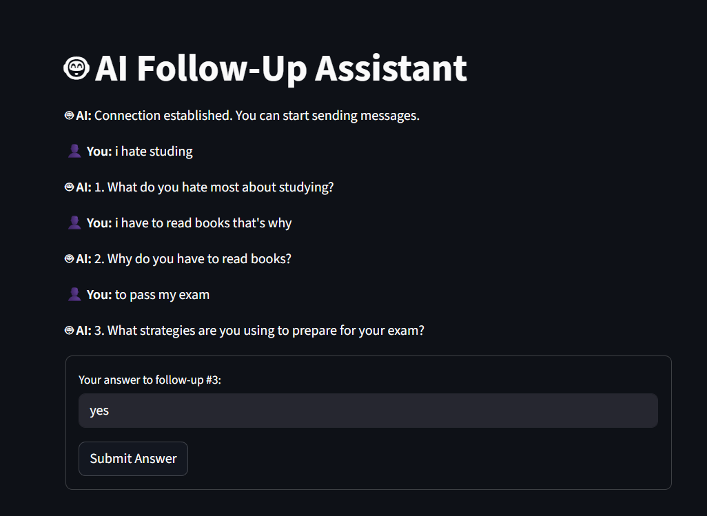
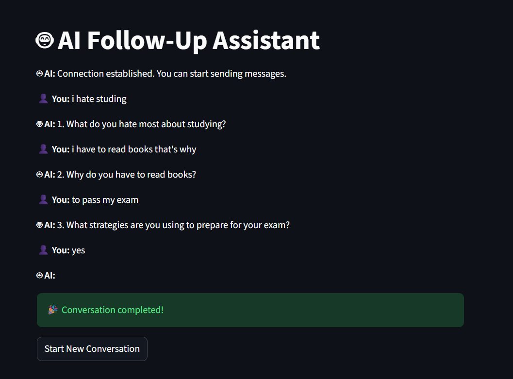

# ACADZA Assignment – AI Follow‑Up Assistant

An end‑to‑end **AI-powered follow-up question generator** built using **FastAPI, WebSockets, LangChain, Groq LLM, and Streamlit**.

The system takes a user's initial sentence and dynamically generates **three intelligent follow-up questions** in real time via a **WebSocket-based conversational flow**.

---

## 📌 Features

* 🔗 **Real-time WebSocket communication** between frontend and backend
* 🧠 **LLM-powered follow-up question generation** using Groq (Qwen 32B)
* 🔄 **Stateful multi-step conversation flow** (3 follow-ups)
* ⚡ **FastAPI backend** with clean modular design
* 🎨 **Streamlit frontend** with chat-style UI
* 🔐 Secure API key handling using `.env`

---

## 🏗️ Project Structure

```
ACADZA-Assignment/
│
├── backend_src/
│   ├── api.py              # FastAPI app + WebSocket logic
│   ├── ai_factory.py       # Groq LLM initialization
│   ├── follow_up.py        # Follow-up question generator logic
│   ├── prompt.py           # LangChain prompt template
|   ├── requirements.txt    # Requirements for frontend to make api live
│
├── frontend_src/
│   └── app.py              # Streamlit frontend (WebSocket client)
│
├── config.py               # Environment & API key loader
├── requirements.txt        # Python dependencies
├── .env                    # API keys (not committed)
└── README.md
```

---

## 🧠 AI Integration (LangChain + Groq)

* The LLM is initialized in **`ai_factory.py`** using `ChatGroq`
* Model used: **`qwen/qwen3-32b`**
* LangChain pipeline:

```
PromptTemplate → Groq LLM → Response Cleanup
```

### Prompt Rules

* Generate **ONLY ONE** follow-up question
* The question **must include one exact word** from the user's input
* Output must be natural, conversational, and clean

---

## 🔁 WebSocket Conversation Flow

### Backend (`/ws` endpoint)

1. Client connects → server sends welcome message
2. Client sends initial sentence
3. AI generates Follow-up #1
4. Client answers
5. AI generates Follow-up #2
6. Client answers
7. AI generates Follow-up #3
8. Client answers
9. Server responds with final acknowledgment

> Entire flow is handled **within a single WebSocket session**

---

## 🎨 Frontend Flow (Streamlit)

* User enters an initial sentence
* Streamlit establishes WebSocket connection
* Messages are exchanged step-by-step
* Session state tracks conversation progress
* Clean chat-style UI with conversation history

---

## ⚙️ Setup Instructions (Local)

### 1️⃣ Clone Repository

```
git clone https://github.com/your-username/acadza-assignment.git
cd acadza-assignment
```

### 2️⃣ Create Virtual Environment

```
python -m venv venv
source venv/bin/activate   # Linux / Mac
venv\Scripts\activate      # Windows
```

### 3️⃣ Install Dependencies

```
pip install -r requirements.txt
```

### 4️⃣ Configure Environment Variables

Create a `.env` file:

```
groq_api_key=YOUR_GROQ_API_KEY
google_gemini_api_key=OPTIONAL
```

---

## ▶️ Run the Project Locally

### 🔹 Start Backend (FastAPI)

```
uvicorn backend_src.api:app --reload
```

Backend will run at:

```
http://localhost:8000
ws://localhost:8000/ws
```

---

### 🔹 Start Frontend (Streamlit)

```
streamlit run frontend_src/app.py
```

Frontend will open at:

```
http://localhost:8501
```

> Update WebSocket URL in `frontend_src/app.py` when running locally:

```
ws.connect("ws://localhost:8000/ws")
```

---

## 🌐 Production Deployment

* Backend deployed on **Render**
* Secure WebSocket endpoint:

```
wss://acadza-assignment-3.onrender.com/ws
```

Frontend connects directly to the live WebSocket server.

---

## 📸 Screenshots 


1. **Frontend UI – Initial Input Screen**



2. **AI Follow-up Question Display**



3. **Multi-step Conversation Flow**



4. **Final Completion Screen**


## 🧪 Tech Stack

* **Backend:** FastAPI, WebSockets, Uvicorn
* **Frontend:** Streamlit
* **LLM:** Groq (Qwen 32B)
* **AI Orchestration:** LangChain
* **Environment:** Python 3.10+

---


